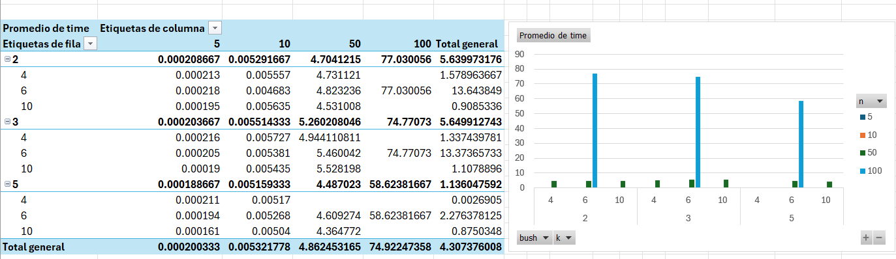

**Laberinto**
El laberinto que trabajamos nosotros es un laberinto dinamico con 5 tipos de casillas, las cuales son:

  | Valor | Tipo | 
  |-------|------|
  | 0 | camino |
  | 1 | pared |
  | 2 | inicio |
  | -1 | salida falsa | 
  | -2 | salida real |

La creación del laberinto consiste en una matriz con un tamaño indicado por el usuario, una cantidad de salidas indicadas por usuario, y finalmente, un valor que representa la densidad de paredes, el cual es inverso a esta proporción, ya que, por ejemplo, si el número es 5, la probabilidad de que una casilla sea pared va a ser de 1 entre 5.
Luego, se crean las paredes(salidas), eligiendo aleatoriamente k (con k el valor indicado por el usuario) casillas ubicadas en los laterales del laberinto, de las cuales la primera es la real, y las otras las falsas.
Finalmente, para cambiar el estado de las casillas lo que se hace es llamar casilla a casilla y selecionar una función dentro de estas que puede variar su estado entre camino o pared, dependiendo del parámetro de densidad antes explicado. Este metodo fue elegido dado que consideramos que el laberinto funciona mejor y mas aleatoriamente si todas las casillas pueden o no ser caminos, esto le entrega mas dificultad a los algoritmos, y permite mejores resultado y testeos mas únicos.

**Algoritmos Utilizados**
Para esta tarea se tomó la decisión de utilizar no solo 2 algoritmos sino que 3, 
uno no infomado, el cual es un bfs, uno si informado el cual es una variante del A*(A estrella),
y uno genético, el cual funciona segun la metodologia de mutaciones y convinaciones de caminos.

*BFS:*
El algoritmo de bfs funciona con una cola, la cual va ingresando los vecinos accesibles desde la posición inicial, y luego va ampliando el recorrido en función de los nuevos vecinos que se van añadiendo. Para controlar el tema del un laberinto movil, lo que se hace es bloquear los vecinos sobre los cuales tiene acceso el bfs, es decir, aquellos que están en la cola, esto dado que sería como si una persona estuviese parada ahí, por lo que el laberinto no puede cambiar en esos lugares. Finalmente, cuando resulta que uno de los vecinos a los cuales se expandío era la salida real, retorna True en significado de que logró encontrar la salida, de no ser así, retorna False.
Una medida de seguridad para que el bfs no se quede sin caminos por culpa de las paredes, si una casilla no logra expandir nada, se vuelve a agregar a la cola, pero para evitar que esto pase infinitamente, la matriz de visitados guarda un registro de cuantas veces se han vuelto a agregar las casillas, y si este supera las 3 veces, entonces ya no se agrega.

*Astar:*
Nuestro algoritmo AStar es una modificación al original, ya que, dado que consume un exeso de memoria en guardar el camino completo para luego volver al anterior como lo hace el dfs, pero en lugar de nosotros almacenar todo el camino, lo que hacemos es guardar solo los 3 nodos con mejor heurística antes de modificar el laberinto, esto para no tener que volver a evaluar todo el recorido, y poder mejorar el rendimiento. ¿Cómo se notó esto? Bueno pues se notó considerablemente, siendo este algoritmo el mas veloz en todas las pruebas y consistente en siempre encontrar la salida. Sumandole esto, para poder asegurarse el encontrar la salida, este algoritmo tiene la capacidad de esperar turnos a que el laberinto cambie en caso de no poder expandir las casillas por culpa de las paredes, lo que hace es quedarse parado, esperar a que cambie el laberinto, y luego volver a revisar, pero como no dejaremos que quede esperando infinitamente, le permitimos esperar solo 3 turnos, y si para ese entonces aun no puede moverse, pues damos por finalizado el intento y calificado como una falla y no un éxito de escape.
La heuristica que usamos para este algoritmo es la heurística manhattan, la cual obtiene la distancia de cierta casilla a la casilla de salida real, la cual está almasenada como una variable dentro de la clase Laberinto.

*Algoritmo Genético:*
El algoritmo geenético, como era de esperarse, es un poco mas complicado, pero su implementación fue inspirada en el código encontrado en [GeeksforGeeks](https://www.geeksforgeeks.org/dsa/genetic-algorithms/), el cual explica como encontrar una cadena de strings usando un algoritmo genético que la genere. En este caso, lo que hacemos es primero generar una cantidad de caminos, los cuales estan conformados por enteros del 0 al 3 con cada uno significando una dirección a la cual moverse en el laberinto([0,1,2,3] = [arriba, abajo, izquierda, derecha]); y luego calculamos el valor fitness de cada uno, para ello, simulamos los movimientos del camino en la matriz sin modificar aun, y vemos si este cumple con los requisitos, los cuales son no salirse del mapa ni intentar atravesar obstaculos, de no ser así es castigado con el valor fitness maximo (float('inf')), pero si logra avanzar sin fallar, se calcula la distancia de la casilla en la cual quedo hasta la meta. En este caso y por temas de complejidad y tiempo de solución no consideramos las posibles paredes en dicho camino, sino que obtenemos la distancia manhattan.
Luego se seleccionan los 20 mejores caminos en base al fitness, y los demás se crean a partir de crosover y mutación de otros caminos.
Finalmente cambiamos el laberinto, y repetimos el proceso. Decidimos dejar fijas la cantidad de caminos en 80 y la cantidad de genereciones en 300 con el fin de poder testear en nuestros computadores, sin tener que estar corriendo el código demasiado tiempo.

**Metodología de evaluación**
Para evaluar el rendimiento de los códigos se construyo el archivo run.sh, con el fin de dejarlo corriendo en la noche y poder evaluar los resultados con graficos en la mañana. Pero dado complicaciones con windows y este tipo de archivos, se recurrio a crear otro archivo, esta vez main2.py. en cual se ejecuta la misma logística de código, pero en un archivo que no tiene problemas para funcionar en windows.
Estos archivos lo que hacen recorrer ciertos *for* anidados, en los cuales se va eligiendo entre: tipo de algoritmo *["bfs", "gen", "Astr"]*, tamaño del laberinto *[5, 10, 50, 100]*, cantidad de salidas *[4, 6, 10]*, y densidad de paredes *[2, 3, 5]* (explicada anteriormente). La elección de estos parametros de prueba fue tomada en función del rendimiento de los algoritmos en situaciones simples y difíciles(tamaños de laberintos pequeños y grandes), y para probar variedad de laberintos.

En caso de que usted profesora desee evaluar cada algoritmo por su cuenta lo que debe hacer es correr el archivo Main.py. Para esto debe clonar el repositorio, estar situado en la carpeta raíz, y correr el siguieinte comando, remplanzado cada eje por los valores que desee: **python Main.py <tamaño lab> <cant salidas> <algoritmo> <densidad>** ; esto iniciara el proceso de crear el laberinto y lo solucionara con el algoritmo que desee(el parámetro algoritmo debe ser uno de los antes mencionado y con la nomenclatura dicha en el párrafo anterior).

**Resultado**
Los resultados obtenidos fueron sorprendentes en algunos algoritmos, pero esperados en otros.

Para el caso del algoritmo bfs, este se comportó muy bien el tamaños pequeños, dado que logra expandirse bien y en poco tiempo, pero cualdo evaluamos los tamaños mas grandes este algoritmo sufrio fuertes caídas, teniendo tiempos exesivamente grandes, al punto de que nos fue muy difícil evaluarlo corrertamente en laberintos de tamaño 100 ya que el tiempo era muy mayor y tuvimos que detener el experimento, obteniendo muy pocos resultados.

 

Como se puede ver, los tiempos en laberintos de tamaño 5 y 10 son bastante pequeños y constantes, pero ya al evaluar grillas de tamaño 50, estos crecen bastante comparado a los anteriores, y cuando se trata de laberintos de 100x100, ya aumenta a niveles exagerados.

Pero, como un dicho conocido señala: "No hay mal que por bien no venga", ya que este algoritmo tiene una capacida de encontrar la salida del 100% en nuestras evaluaciones, esto dado a su capacidad de volver a añadir celdas no expandidas, y a que su metodología de trabajo explora el laberinto en su capacidad, por lo que, es lento y con un alto costo, pero efectivo.

**Reflexiones**
